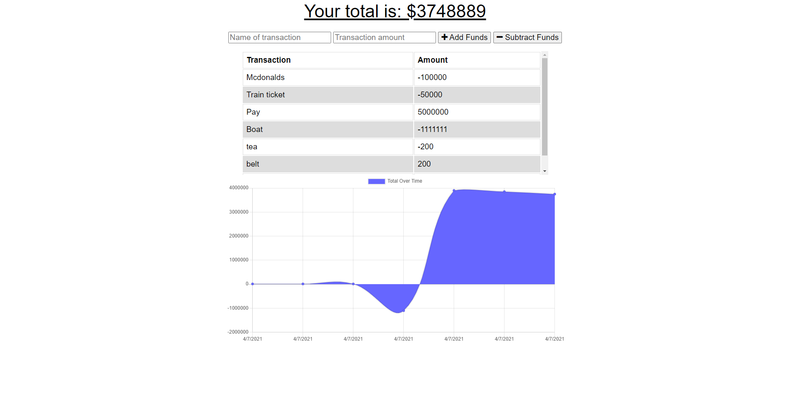
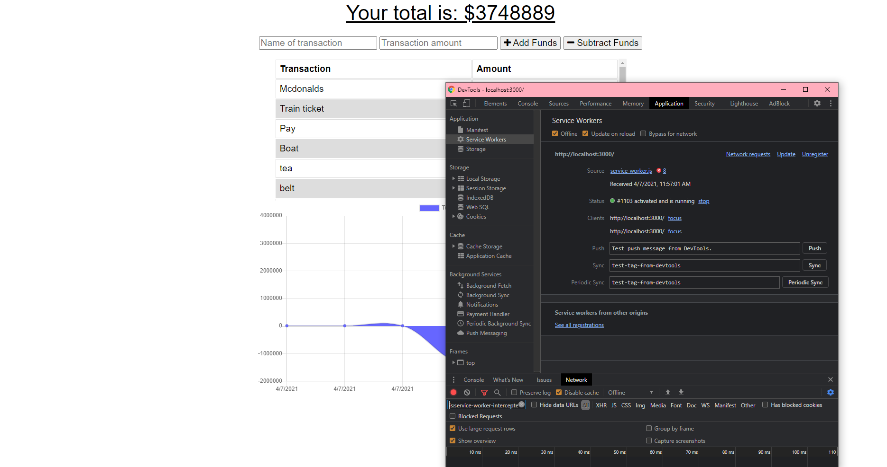

# Budget Tracker
      

## Description
    An application that can be used to track spending and earnings over time- using mongodb and manifests and service worker to enable offline functioality. 

## Table of Content
   
* [Installation](#installation)
     
* [Usage](#usage)

* [Future Direction](#Future-Direction)

* [Live Screenshots](#Live-Screenshots)

* [Contributions](#Contributions)
       
* [Credits](#credits)
    
* [License](#license)
     
  

    
  
## Installation
1.  For local deployment - install node, run code "npm i" then "npm start" 
2.  Alternate Method - Click on this [Deployed Link](https://obscure-spire-11105.herokuapp.com/)
  
## Usage
    This application takes in users input; transaction name and transaction amount. The user can choose whether this will be an expense or income using the available buttons. 

    The data being inputted by the user is stored in a mongoose database, API calls are made to pull that information and display them. This web application aslo includes functionality for installation and offline functionality - try it out if youd like! 

## Future Direction
* Allowing user to set a budget for the tracker.
* Creating alerts based on the balance letting the user know when they are getting close to their limit.
* Allowing users to remove transactions made in error or clearing the fields.

### Live Screenshots

### Contributions 

    This application has an MIT license and is completely open to open source contribution! Feel free to fork and enhance the functionality and add features if you would like! 

### Changelog
    Version: 1.0: First Release 
    
## Credits
    N/A
    
## License
     MIT
      
    
## Questions
* Github : [Ezkenneth](github.com/Ezkenneth)
* E-mail : Reach me at - kennethjoeezigbo@gmail.com